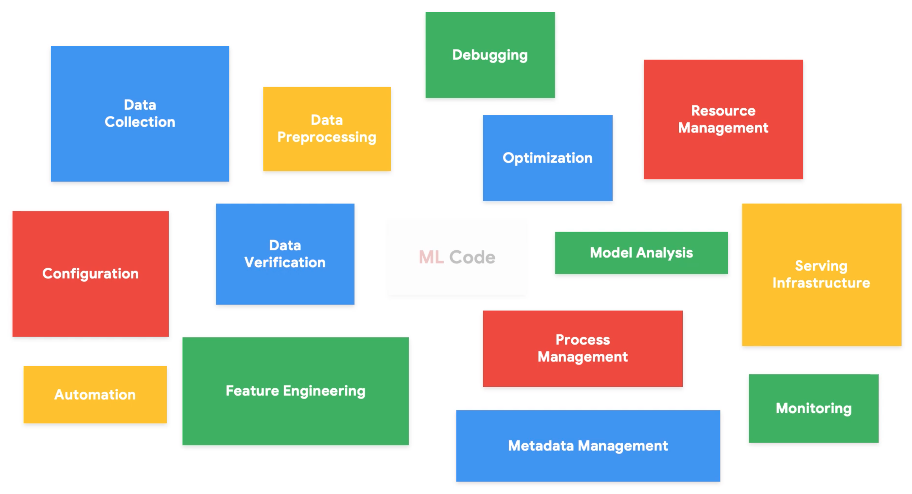
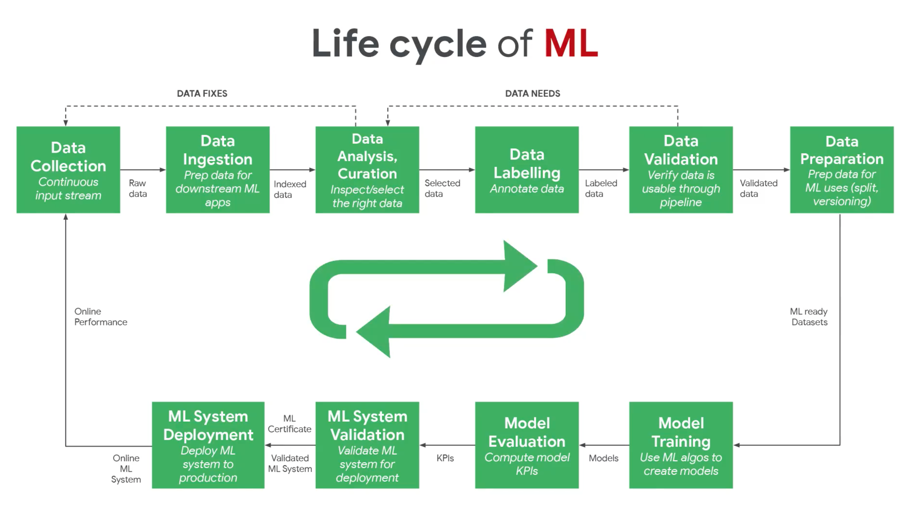
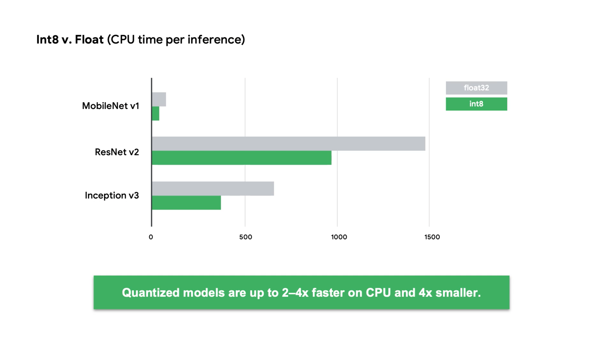
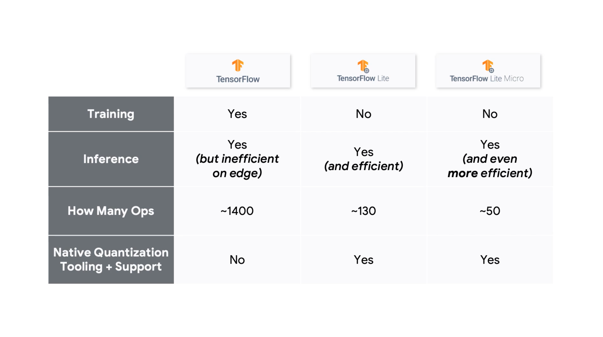
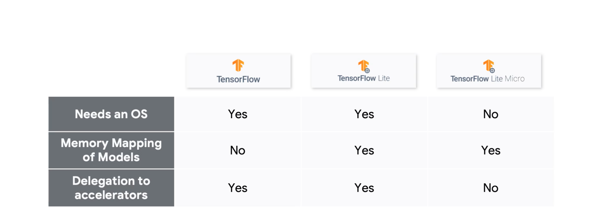
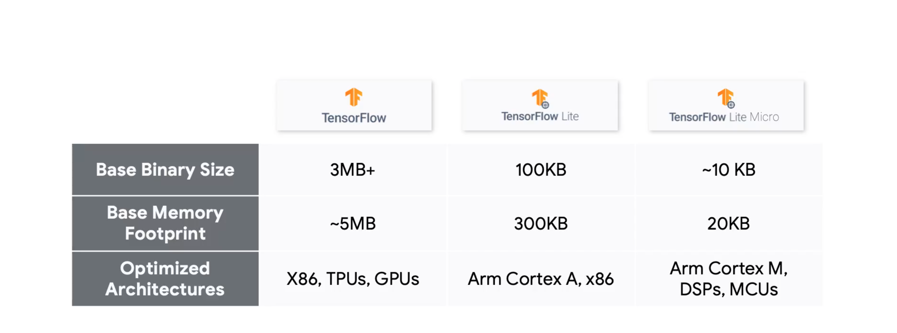
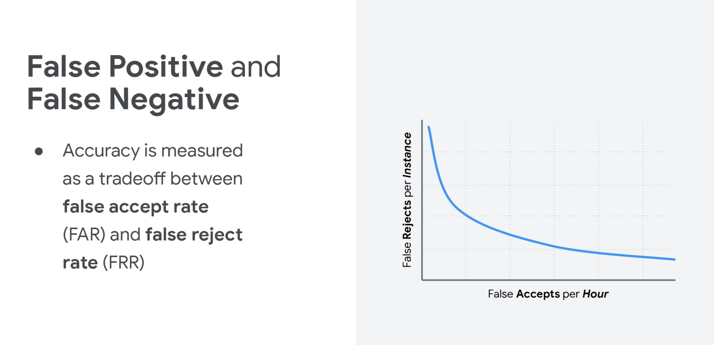

# TinyML

## Description

This repository documents the essential concepts for review and deeper understanding. It is the skelenton of the course, which I find is the most important part to grasp. Some notebooks are included for exploration and experimentation.

## Structure of Certification

1. Fundamentals of TinyML
2. Applications of TinyML
3. Deploying TinyML

## Fundamentals of TinyML

__Tiny machine learning__, or tinyML, is an emerging field that is at the intersection of machine learning and embedded systems. And embedded system is a computing device that is usually small, or tiny, and operates on extremely low power.

- Strict definition: TinyML is a fast-growing field of machine learning technologies and applications including hardware, algorithms, and software capable of performing on-device sensor data analytics at extremely low power, typically in the milliwatt (mW) range and below, and hence enabling a variety of always-on use-cases and targeting battery-operated devices.

There is an increasing interest in putting machine learning models on tiny devices, since it can enable a wide range of applications that require low latency, privacy, and offline inference.

__Machine Learning__ is a subfield of Artificial Intelligence focused on the development of algorithms that can learn to solve problems by analyzing data for patterns. __Deep Learning__ is a subfield of Machine Learning that uses deep neural networks to solve problems.

__Big data__ accumulates at large companies, and it is used to train machine learning models. There is about 5 Quintillion bytes of data generated by IoT every day, but less than 1% of that data is analyzed or used at all. This is suprising because the models are already very good with such a small amount of data, so imagine how much better they could be with more data. That is what TinyML is trying to do, by making ML ubiquitous within every device around us. The possibilities are endless, thus __the future is tiny and bright__.

    "TinyML will soon be everywhere, powering the next generation of smart embedded devices. These devices will be in our homes and in very remote locations, enabling remote monitoring for both industry and ecology. Today, in these remote monitoring settings, 99% of raw sensor data is discarded, which is a wealth of data for machine learning!
    
    TinyML can provide a unique solution: by summarizing and analyzing data at the edge on low power embedded devices, TinyML can provide smart summary statistics that take these previously lost patterns, anomalies, and advanced analytics into account."

A good example of a TinyML device is this [wind turbine device](https://www.engineering.com/story/iot-device-detects-wind-turbine-faults-in-the-field).

The fundamental steps of TinyML are:

1. __Input__
   - Sensor data (motion, acoustic, environmental, touchscreen, image, biometric, force, rotation, etc.)
2. __Processing__
    - Use very little power, such as the Syntiant NDP100 which is only 2.52 mm squared and uses 140 microWatts, which is ultra low power.
    - Translation, then execute command
3. __Output__
    - Generate output

There are billions of MCUs (extremely tiny computers) in the world, and they can be made smart by adding a machine learning model to them. Essentially, the infrastructure is already there and the demand forecast is high, and we just need to put it to use. MCUs enable TinyML since they are __very small, low power, low cost, and their demand is high__.

TinyML Hardware:

1. Compute (brain)
2. Memory (temporary storage)
3. Storage (permanent storage)

__Microprocessor vs Microcontroller__:

- Microprocessor is the heart of a computer system, while microcontroller is the heart of an embedded system.
- In a microprocessor the processor, memory, and storage are external, while in a microcontroller the storage and memory are internal.
- Microprocessor mainly used in general purpose systems, while microcontroller is used in specialized, fixed function systems.
- Microprocessor offers flexibility in design, while microcontroller offers limited flexibility in design.
- Microprocessor size is big, while microcontroller size is tiny.

TinyML Software:

1. Applications
2. Libraries
3. Operating System: typically embedded systems do not have an OS, but they can have one.

For ML models to work on tiny embedded systems, we need to shrink the model without removing its ability to fundamentally look for patterns in data. To do this we could use model compression techniques, such as __quantization__, __pruning__, and __knowledge distillation__.

__Responsible AI__: AI that is fair, inclusive, transparent, and accountable. AI offers great benefits, but also introduce new risks and ethical challenges, since it could:

- __Change__ current practices
- __Influence__ human decisions
- __Regulate__ human behavior

Responsible AI = increased marketability, increased product-adoption, and increased trust. Companies can do well by doing good.

Machine learning takes data and labels, then ouputs rules. This results in a model, which then takes in data and outputs inferences.

Machine learning paradigm:

1. Make a guess
2. Measure the accuracy
3. Optimize your guess

Measuring the effectiveness of a guess is known as the __loss function__. The loss function is a measure of how well the model is doing. The goal is to minimize the loss function, which is done by improving the guess.

__Gradient descent__ is an optimization algorithm that is used to minimize the loss function. It is an iterative algorithm that starts with an initial guess, then takes steps in the direction of the negative gradient to minimize the loss function. The gradient is the slope of the loss function, and the negative gradient is the direction of steepest descent. The __learning rate__ is the size of the step taken in the direction of the negative gradient.

A __neuron__ is a mathematical function that takes in a weighted sum of inputs, adds a bias, and then applies an activation function.

Data is usually split into testing, validation, and training sets. The training set is used to train the model, the validation set is used to tune the hyperparameters, and the testing set is used to evaluate the model.

AI is not always the answer. Sometimes traditional programming is better, such as when the problem is well defined and the rules are known. AI is better when the problem is not well defined and the rules are not known (or cannot be specified by domain experts).

## Applications of TinyML

Endpoints have many sensors, and they can be used to collect data. This data can be used to train a model, which can then be deployed to the endpoint to make inferences. This is known as __edge computing__.

__Inference__ is the process of using a trained model to make predictions on new data.

TinyML application Areas:

1. Home
   - Keyword spotting ("Hey Siri", "Alexa", "OK Google")
2. Office
   - Camera sensor to detect occupancy in a room, which controls when lights are on/off
3. Industry
   - TinyML will potentially be pervasive in the industrial space, which makes it one of the most important areas for TinyML
   - Can do predictive maintenance by detecting anomalies in machines

Quote:

    To overcome [some of the] challenges, the following rules of thumb are recommended:

    1 - Collect rich data. In the machine learning world, data is power. A sufficiently large amount of data should be collected to ensure that our TinyML models are able to effectively approximate the distribution of the data. More data never hurts!

    2 - Don’t over-engineer your system. While it may seem attractive to add fifteen sensors to a system, we should follow Occam’s razor when engineering our system that “entities should not be multiplied without necessity”. Being intelligent and yet parsimonious with our sensor selection will minimize the possibility of running into hardware complications.

    3 - Plan to cover all possible sources of variation. The statistical power of our model will always be limited by the data at hand. Consequently, it is helpful to cover as much ground as possible without conflicting with #2. This can involve collecting data that covers edge cases as well as using additional sensors that are expected to provide some additional explanatory power to the model.

    4 - Use the highest workable sampling rate. Although it is highly expensive to transmit and store high-frequency data, we limit these issues when we are using TinyML systems since inferences are made on-device and streamlined to minimize storage. It is much easier to downsample data when there is too much than to upsample it when there is not enough. Thus, when collecting data to use for model training, it is recommended to obtain the highest resolution data possible to provide flexibility in downstream data engineering processes.

AI Infrastructure:

1. Data Engineering
   - Define data requirements
   - Collect the data
   - Label the data
   - Clean the data
   - Prepare the data
   - Augment the data
   - Add more data
2. Model Engineering
   - Train the model
   - Improve training speed
   - Set target metrics
   - Evaluate the model against the target metrics
3. Model Deployment
   - Model conversion
   - Optimize the performance
   - Energy-aware optimization
   - Security and privacy
   - Inference serving APIs
   - On-device fine-tuning
4. Product Analytics
   - Dashboards
   - Field data evaluation
   - Value-added for business
   - Opportunities for advancements and improvements

We can do model quantization with representative data. This changes the model from an floating point model to an integer model, which reduces the size of the model and the amount of computation required to run the model.

__Quantization__ is an optimization that works by reducing the precision of the numbers used to represent a model's parameters, which by default are 32-bit floating point numbers. This results in a smaller model size, better portability and faster computation.

__Post Training Quantization__: Quantization that is done after the model has been trained.

__Quantization Aware Training__: Quantization that is done during the training process.

One way to reduce precision is to discretize the weights (hash floating point valued weights to integers). Quantization can be done on other parts of the neural network, not just the weights. The benefit of quantization aware training over post training quantization is that it can result in a more accurate model, since it allows the training phase to account for the errors introduced by quantization.

Keyword spotting is one of the most successful examples of TinyML.

Challenges and constraints in keyword spotting:

1. Latency and Bandwidth
   - Want to provide results quickly
   - Need to minimize data sent over the network
2. Accuracy and Personalization
   - Need to continuously listen but only trigger on the right keyword
   - Trigger for the user and not for background noise
3. Security and Privacy
   - Safeguarding the data that is being sent to the cloud
4. Battery and Memory
   - Limited energy, operate on coin-cell type batteries
   - Run on resource constrained devices

Datasets are extremely important. If they are done wrong everything else will be a waste of effort.

Data preprocessing:

- Fourier transforms turn time-domain signals into frequency-domain signals
- Spectograms are a visual representation of the spectrum of frequencies of a signal as it varies with time
- Mel Fiterbanks are a set of filters that are used to extract features from audio signals
- Data can also be normalized and denoised

Metrics to evaluate models:

- Accuracy
  - Type I error: False positive
  - Type II error: False negative
  - 
- Efficiency
  - Model must be fast enough to keep up with speech input
  - The model must run fast enough to be responsive to the end user
  - It must run efficiently on a small processor
- Beyond Model Metrics
  - Memory Usage
    - Need to be resource aware
  - Quality of Experience (QoS)
    - Have diverse users to test against
    - Test in different backgrounds
