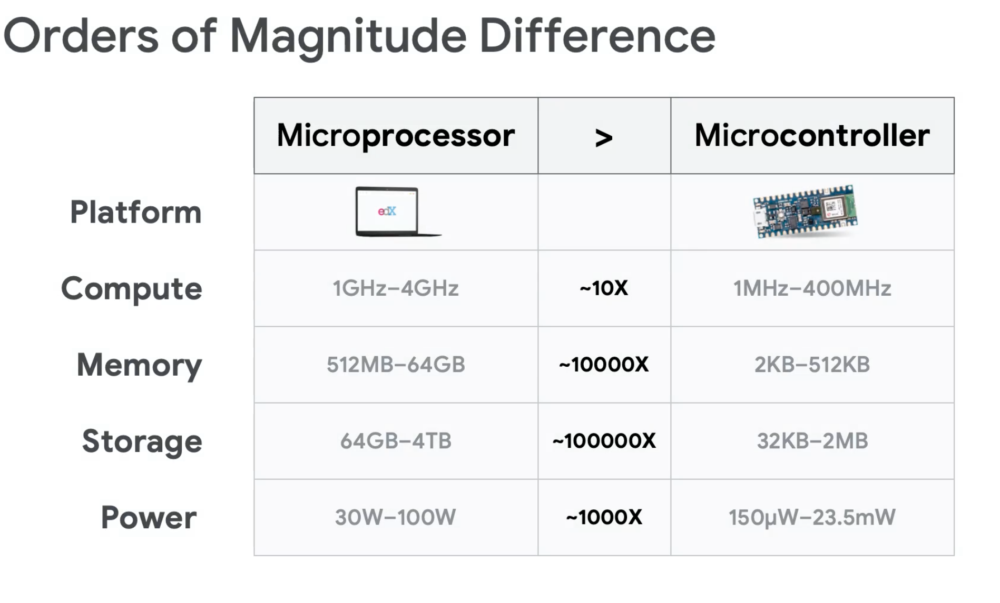
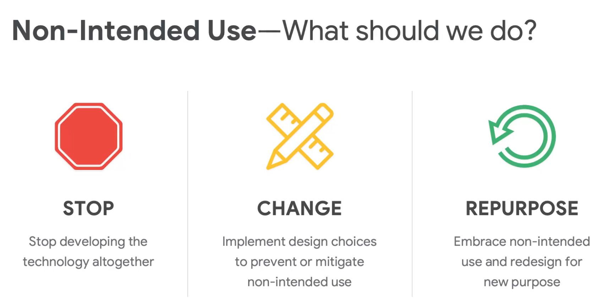

# TinyML

## Description

Notes on the HarvardX TinyML course on EdX.

## Approach to this Repository

This repository documents the essential concepts for review and deeper understanding. It is the skelenton of the course, which I find is the most important part to grasp. Some notebooks are included for exploration and experimentation.

## Structure of Certification

1. Fundamentals of TinyML
2. Applications of TinyML
3. Deploying TinyML

## Fundamentals of TinyML

__Tiny machine learning__, or tinyML, is an emerging field that is at the intersection of machine learning and embedded systems. And embedded system is a computing device that is usually small, or tiny, and operates on extremely low power.

- Strict definition: TinyML is a fast-growing field of machine learning technologies and applications including hardware, algorithms, and software capable of performing on-device sensor data analytics at extremely low power, typically in the milliwatt (mW) range and below, and hence enabling a variety of always-on use-cases and targeting battery-operated devices.

There is an increasing interest in putting machine learning models on tiny devices, since it can enable a wide range of applications that require low latency, privacy, and offline inference.

__Machine Learning__ is a subfield of Artificial Intelligence focused on the development of algorithms that can learn to solve problems by analyzing data for patterns. __Deep Learning__ is a subfield of Machine Learning that uses deep neural networks to solve problems.

__Big data__ accumulates at large companies, and it is used to train machine learning models. There is about 5 Quintillion bytes of data generated by IoT every day, but less than 1% of that data is analyzed or used at all. This is suprising because the models are already very good with such a small amount of data, so imagine how much better they could be with more data. That is what TinyML is trying to do, by making ML ubiquitous within every device around us. The possibilities are endless, thus __the future is tiny and bright__.

    "TinyML will soon be everywhere, powering the next generation of smart embedded devices. These devices will be in our homes and in very remote locations, enabling remote monitoring for both industry and ecology. Today, in these remote monitoring settings, 99% of raw sensor data is discarded, which is a wealth of data for machine learning!
    
    TinyML can provide a unique solution: by summarizing and analyzing data at the edge on low power embedded devices, TinyML can provide smart summary statistics that take these previously lost patterns, anomalies, and advanced analytics into account."

A good example of a TinyML device is this [wind turbine device](https://www.engineering.com/story/iot-device-detects-wind-turbine-faults-in-the-field).

The fundamental steps of TinyML are:

1. __Input__
   - Sensor data (motion, acoustic, environmental, touchscreen, image, biometric, force, rotation, etc.)
2. __Processing__
    - Use very little power, such as the Syntiant NDP100 which is only 2.52 mm squared and uses 140 microWatts, which is ultra low power.
    - Translation, then execute command
3. __Output__
    - Generate output

There are billions of MCUs (extremely tiny computers) in the world, and they can be made smart by adding a machine learning model to them. Essentially, the infrastructure is already there and the demand forecast is high, and we just need to put it to use. MCUs enable TinyML since they are __very small, low power, low cost, and their demand is high__.

TinyML Hardware:

1. Compute (brain)
2. Memory (temporary storage)
3. Storage (permanent storage)

__Microprocessor vs Microcontroller__:

- Microprocessor is the heart of a computer system, while microcontroller is the heart of an embedded system.
- In a microprocessor the processor, memory, and storage are external, while in a microcontroller the storage and memory are internal.
- Microprocessor mainly used in general purpose systems, while microcontroller is used in specialized, fixed function systems.
- Microprocessor offers flexibility in design, while microcontroller offers limited flexibility in design.
- Microprocessor size is big, while microcontroller size is tiny.

TinyML Software:

1. Applications
2. Libraries
3. Operating System: typically embedded systems do not have an OS, but they can have one.

For ML models to work on tiny embedded systems, we need to shrink the model without removing its ability to fundamentally look for patterns in data. To do this we could use model compression techniques, such as __quantization__, __pruning__, and __knowledge distillation__.

__Responsible AI__: AI that is fair, inclusive, transparent, and accountable. AI offers great benefits, but also introduce new risks and ethical challenges, since it could:

- __Change__ current practices
- __Influence__ human decisions
- __Regulate__ human behavior

Responsible AI = increased marketability, increased product-adoption, and increased trust. Companies can do well by doing good.

Machine learning takes data and labels, then ouputs rules. This results in a model, which then takes in data and outputs inferences.

Machine learning paradigm:

1. Make a guess
2. Measure the accuracy
3. Optimize your guess

Measuring the effectiveness of a guess is known as the __loss function__. The loss function is a measure of how well the model is doing. The goal is to minimize the loss function, which is done by improving the guess.

__Gradient descent__ is an optimization algorithm that is used to minimize the loss function. It is an iterative algorithm that starts with an initial guess, then takes steps in the direction of the negative gradient to minimize the loss function. The gradient is the slope of the loss function, and the negative gradient is the direction of steepest descent. The __learning rate__ is the size of the step taken in the direction of the negative gradient.

A __neuron__ is a mathematical function that takes in a weighted sum of inputs, adds a bias, and then applies an activation function.

Data is usually split into testing, validation, and training sets. The training set is used to train the model, the validation set is used to tune the hyperparameters, and the testing set is used to evaluate the model.

AI is not always the answer. Sometimes traditional programming is better, such as when the problem is well defined and the rules are known. AI is better when the problem is not well defined and the rules are not known (or cannot be specified by domain experts).

## Applications of TinyML

Endpoints have many sensors, and they can be used to collect data. This data can be used to train a model, which can then be deployed to the endpoint to make inferences. This is known as __edge computing__.

__Inference__ is the process of using a trained model to make predictions on new data.

TinyML application Areas:

1. Home
2. Office
3. Industry
 